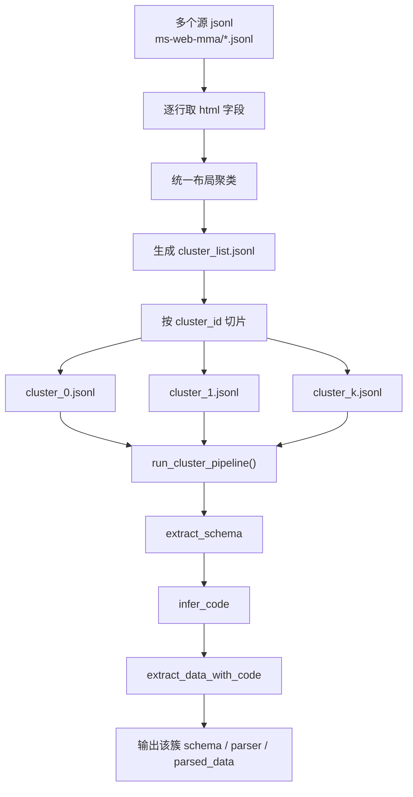

# 业务代码版流程（只保留聚类与按簇抽取）

**业务逻辑**：

1. 多个源 `jsonl` 的 `html` 如何统一做布局聚类
2. 聚类后如何按簇切片
3. 每个 cluster 如何分别执行：
   - `extract_schema`
   - `infer_code`
   - `extract_data_with_code`

这份文档**不展开**下面这些外围实现：

- 如何从 S3 下载
- 如何上传回 S3
- 如何写 summary
- 如何做最终发布与字节定位

---

## 1. 流程图



- 先把多个源 jsonl 里的每条页面按 html 统一聚类，生成一张 cluster 索引表，再按 cluster 把原始数据重组切片，为后面的按簇 schema 学习和 parser 生成做准备。
- 聚类之后会被重组为“每个 cluster 一份输入 jsonl”
- `run_cluster_pipeline()` 处理的是“单个 cluster 的输入 jsonl”
- 每个 cluster 都会各自执行一遍 `extract_schema -> infer_code -> extract_data_with_code`

---

## 2. 先区分两层输入

### 第一层：站点原始输入

像 `ms-web-mma` 这种，原始输入是：

- 一个目录
- 里面有很多源 `jsonl`
- 比如当前有 6 个源 `jsonl`

这些是**聚类前**的原始数据集。

### 第二层：按簇切片后的输入

当你做完：

1. 合并所有源 `jsonl`
2. 对每行 `html` 统一布局聚类
3. 按 `layout_cluster_id` 切片

之后，才会得到：

- `ms_web_mma_union_cluster_0.jsonl`
- `ms_web_mma_union_cluster_1.jsonl`
- ...

这里每个 `cluster_x.jsonl`：

- 只对应一个 cluster
- 但里面的数据行可能来自很多个源 `jsonl`

所以：

- 不是“每个源 `jsonl` 跑一次 schema / parser”
- 而是“每个 **cluster** 跑一次 schema / parser”

---

## 2.1 关键字段说明

下面这几个字段是整条链路里最重要的“串联键”，后面聚类、按簇抽取、回填时都会反复用到：

| 字段 | 含义 | 典型来源 | 主要用途 |
|---|---|---|---|
| `global_index` | 合并所有源 `jsonl` 后，为每一行分配的全局顺序号 | 业务层在合并多源 `jsonl` 时生成 | 作为最稳定的全局行索引，用于聚类结果和回填结果对齐 |
| `source_name` | 当前记录来自哪个源文件名，例如 `20260310094859_...jsonl` | 从源 `jsonl` 路径提取 | 用于区分不同源文件，也用于最终按 `source_name` 分文件发布 |
| `line_no` | 当前记录在该源 `jsonl` 文件中的行号 | 逐行读取源 `jsonl` 时生成 | 与 `source_name` 组合后可唯一定位源文件内的一行 |
| `record_id` | 当前记录的业务主键，优先取 `track_id`，没有时再兜底生成 | 源数据中的 `track_id` 或业务层兜底逻辑 | 作为单行业务标识，也用于切片和解析结果映射 |

可以把这四个字段理解成：

- `global_index`：全局唯一索引
- `source_name + line_no`：源文件内唯一定位
- `record_id`：业务主键

后面不管是：

- `cluster_list.jsonl`
- 单簇 `cluster_x.jsonl`
- `parsed_data`
- 回填 payload

本质上都要依赖这几个字段来把“同一条记录”串起来。

---

## 3. `web2json` 的核心业务 API

`web2json-agent` 里真正需要老师看的业务接口就是这些：

```python
from web2json import (
    Web2JsonConfig,
    classify_crawl_jsonl_dir,
    extract_data_with_code,
    extract_schema,
    infer_code,
)
```

### 3.1 先明确：哪些是仓库现有公开 API，哪些是业务侧包装函数

这里建议在讲解时把边界说清楚：

#### 仓库现有的公开 API

这些是 `web2json-agent` 本身已经提供的接口：

- `classify_crawl_jsonl_dir` (新加)
- `extract_schema`
- `infer_code`
- `extract_data_with_code`

它们都属于：

- `from web2json import ...`

这一层的现成能力。

#### 业务侧包装函数

下面这两个名字是为了讲清楚 `ms-web-mma` 这条业务链而抽象出来的包装函数：

- `classify_from_crawl_html()`
- `run_cluster_pipeline()`

其中：

- `classify_from_crawl_html()`
  - 不是仓库原生公开 API
  - 它是对 `classify_crawl_jsonl_dir()` 的一层业务包装
  - 目的是把“多个源 jsonl 的 html 字段统一做布局聚类”这个业务语义讲清楚

- `run_cluster_pipeline()`
  - 也不是 `web2json` 仓库原生公开 API 名称
  - 它是把：
    - `extract_schema`
    - `infer_code`
    - `extract_data_with_code`
    这三步串起来的一层业务包装


**公开 API 是仓库已有能力，包装函数是你为了把 `ms-web-mma` 业务链讲清楚而组织出来的调用层。**

其中语义可以这样讲：

- `classify_crawl_jsonl_dir`
  - 输入：一个目录下多个 crawl `jsonl`
  - 行为：取每行 `html` 做统一布局聚类
  - 输出：`cluster_list` + 按簇切片后的输入 `jsonl`

- `extract_schema`
  - 输入：单个 cluster 的输入 `jsonl`
  - 行为：学习该簇页面应该抽什么字段
  - 输出：该簇自己的 schema

- `infer_code`
  - 输入：该簇 schema
  - 行为：为该簇生成 parser code
  - 输出：该簇自己的 parser

- `extract_data_with_code`
  - 输入：该簇输入 `jsonl` + 该簇 parser
  - 行为：批量解析该簇内全部页面
  - 输出：该簇的 `parsed_data`

---

## 4. 业务逻辑一：`classify_from_crawl_html()`

“怎么从多个源 jsonl 走到 cluster”，重点看这一段。

### 推荐写法：直接用 `classify_crawl_jsonl_dir`

```python
from web2json import Web2JsonConfig, classify_crawl_jsonl_dir


def classify_from_crawl_html(local_jsonl_dir: str, output_dir: str):
    """
    输入：
        local_jsonl_dir：一个目录，里面有多个源 jsonl

    逻辑：
        1. 读取目录下全部 jsonl
        2. 对每行 html 做统一布局聚类
        3. 生成 cluster_list.jsonl
        4. 按 cluster_id 切出 cluster_0.jsonl / cluster_1.jsonl / ...
    """
    cluster_config = Web2JsonConfig(
        name="classify",
        html_path=local_jsonl_dir,
        output_path=output_dir,
        save=["report", "jsonl"],
        crawl_html_field="html",
        crawl_jsonl_id_field="record_id",
    )
    return classify_crawl_jsonl_dir(
        cluster_config,
        jsonl_dir=local_jsonl_dir,
        recursive=False,
        output_stem="ms_web_mma_union",
        annotate_slice_rows=True,
    )
```

### 这段业务代码真正做了什么

这段不是“按源文件逐个跑完整流水线”，而是：

1. 把目录里多个源 `jsonl` 当成一个全集
2. 对全集里每行的 `html` 做**一次统一布局聚类**
3. 得到全局 `cluster_list`
4. 再按 `layout_cluster_id` 切片

所以这一步完成后，输入维度就从：

- `source_name`

变成：

- `cluster_id`

---

## 4.1 


```text
classify_from_crawl_html()
    -> classify_crawl_jsonl_dir()
        -> _execute_crawl_layout_cluster()
           -> cluster_html_layouts_optimized()
```

可以这样理解：

- `classify_from_crawl_html()`
  - 面向业务代码的包装入口
  - 表达“从多个源 jsonl 的 html 字段做统一聚类”

- `classify_crawl_jsonl_dir()`
  - 面向外部 API 的目录级入口
  - 负责发现目录下全部 `jsonl`、逐行读取、整理成统一 `line_metas`

- `_execute_crawl_layout_cluster()`
  - 真正的内部执行引擎
  - 负责：
    1. 提取布局特征
    2. 调聚类器
    3. 把标签映射回原始行
    4. 写 `cluster_list.jsonl`
    5. 写按簇切片的 `jsonl`

- `cluster_html_layouts_optimized()`
  - 真正执行“布局聚类算法”的底层函数
  - 输入：一组 HTML 字符串
  - 行为：
    1. 基于 HTML 结构提取布局特征
    2. 在特征空间中计算页面之间的相似度
    3. 使用 DBSCAN / KNN 图近似等方式给每个页面分配 cluster label
  - 输出：
    - `labels`：每个页面的簇编号
    - `sim_mat`：页面间相似度矩阵
    - `clusters`：按簇分组后的页面集合
  - “到底是谁在做页面布局聚类”，最底层答案就是：
    - **`cluster_html_layouts_optimized()`**

- **真正干活的是 `_execute_crawl_layout_cluster()`**
- `classify_crawl_jsonl_dir()` 负责把“目录下多个源 jsonl”整理好，再把它们交给这个内部函数统一处理

### `_execute_crawl_layout_cluster()` 完整实现（来自 `web2json/simple.py`）

```python
def _execute_crawl_layout_cluster(
    line_metas: List[Dict[str, Any]],
    config: Web2JsonConfig,
    *,
    output_stem: str,
    hf: str,
    rid_f: Optional[str],
    report_extra: Optional[Dict[str, Any]] = None,
    annotate_slice_rows: bool = False,
) -> ClusterResult:
    """对 crawl JSONL 的已加载行执行统一布局聚类，并可选写出索引与按簇切片。

    这是 ``classify_crawl_jsonl`` / ``classify_crawl_jsonl_dir`` 共用的内部执行函数。
    它不负责发现文件或逐行读取 JSONL，而是假定调用方已经把输入整理成
    ``line_metas`` 列表（见 ``load_crawl_line_metas_for_file``）。

    处理流程：

    1. 为每一行构造稳定键 ``source_name:line_no``，作为标签回填时的对齐键。
    2. 从每行 ``html`` 提取布局特征（``get_feature``）；无 HTML 或特征提取失败的行，
       不参与聚类，后续统一标记为 ``-1``（noise）。
    3. 将可用 HTML 交给 ``cluster_html_layouts_optimized`` 做布局聚类。
    4. 将聚类标签映射回全部输入行，得到与 ``line_metas`` 等长的 ``labels``。
    5. 根据 ``config.save`` 可选写出：
       - ``cluster_report.json`` / ``cluster_info.txt``
       - ``cluster_list.jsonl``
       - 按簇切片的 JSONL

    Args:
        line_metas: 已加载的 crawl 行元信息列表。每个元素通常至少包含
            ``obj``、``html``、``rid``、``source_jsonl``、``source_name``、``line_no``。
        config: ``Web2JsonConfig``，用于控制输出路径和保存内容。
        output_stem: 切片文件名前缀，例如 ``ms_web_mma_union``。
        hf: HTML 字段名（如 ``html``），仅用于报告记录。
        rid_f: 业务主键字段名（如 ``track_id`` / ``record_id``），仅用于报告记录。
        report_extra: 附加到 report 的上下文信息，例如输入目录、文件列表等。
        annotate_slice_rows: 是否在切片后的每行中附加 ``layout_cluster_id``、
            ``crawl_source_name``、``crawl_line_no``。

    Returns:
        ClusterResult:
            - ``clusters``: 非噪声簇到 record_id 列表的映射
            - ``labels``: 与 ``line_metas`` 对齐的簇标签数组
            - ``noise_files``: 被标为 ``-1`` 的 record_id 列表
            - ``cluster_count``: 非噪声簇数量
    """
    from web2json.tools.cluster import cluster_html_layouts_optimized
    from web2json.tools.crawl_jsonl import split_jsonl_by_cluster_labels, write_jsonl_lines
    from web2json.tools.html_layout_cosin import get_feature

    if not line_metas:
        raise ValueError("无有效行")

    # 用 source_name + line_no 作为稳定对齐键，便于后续把聚类结果映射回原始行。
    surrogate_keys: List[str] = [
        f"{m['source_name']}:{m['line_no']}" for m in line_metas
    ]
    valid_keys: List[str] = []
    valid_contents: List[str] = []
    for m, sk in zip(line_metas, surrogate_keys):
        if not m.get("html"):
            continue
        try:
            feature = get_feature(m["html"])
        except Exception as e:
            logger.warning(f"  跳过布局特征提取失败: {sk} ({e})")
            continue
        if not feature:
            logger.warning(f"  跳过无有效布局特征: {sk}")
            continue
        valid_keys.append(sk)
        valid_contents.append(m["html"])

    if not valid_contents:
        raise Exception("聚类失败: 没有可用于布局聚类的有效 HTML 页面")

    try:
        labels_partial, _sim, _clusters = cluster_html_layouts_optimized(
            valid_contents,
            use_knn_graph=True,
        )
    except Exception as e:
        raise Exception(f"聚类失败: {e}") from e

    # 仅有效 HTML 参与了聚类，这里把部分标签映射回全部输入行；
    # 没参与聚类的行统一记为 -1（noise）。
    label_map = {k: int(lbl) for k, lbl in zip(valid_keys, labels_partial)}
    labels = np.array([label_map.get(sk, -1) for sk in surrogate_keys], dtype=int)

    unique_labels = sorted(set(labels.tolist()))
    noise_count = sum(1 for l in labels if l == -1)
    cluster_count = len([l for l in unique_labels if l != -1])

    logger.info("✓ 聚类分析完成")
    logger.info(f"  总行数（非空行）: {len(line_metas)}")
    logger.info(f"  识别出的布局簇数: {cluster_count}")
    logger.info(f"  噪声点（未归类）: {noise_count}")

    clusters_dict: Dict[str, List[str]] = {}
    noise_files: List[str] = []
    for lbl in unique_labels:
        ids = [line_metas[i]["rid"] for i in range(len(line_metas)) if labels[i] == lbl]
        if not ids:
            continue
        if lbl == -1:
            noise_files = ids
            clusters_dict["noise"] = ids
        else:
            clusters_dict[f"cluster_{lbl}"] = ids
        logger.info(f"  {'噪声点' if lbl == -1 else f'簇 {lbl}'}: {len(ids)} 条")

    if config.should_save():
        out_root = Path(config.get_full_output_path())
        out_root.mkdir(parents=True, exist_ok=True)
        stem = output_stem

        if config.should_save_item("report"):
            report_payload: Dict[str, Any] = {
                "source": "crawl_jsonl",
                "html_field": hf,
                "record_id_field": rid_f,
                "clusters": {k: v for k, v in clusters_dict.items() if k != "noise"},
                "noise_record_ids": noise_files,
                "labels": labels.tolist(),
                "record_ids": [m["rid"] for m in line_metas],
                "record_keys": surrogate_keys,
                "source_jsonl": [m["source_jsonl"] for m in line_metas],
                "cluster_count": cluster_count,
                "total_records": len(line_metas),
            }
            if report_extra:
                report_payload.update(report_extra)

            report_json = out_root / "cluster_report.json"
            with open(report_json, "w", encoding="utf-8") as f:
                json.dump(report_payload, f, ensure_ascii=False, indent=2)
            logger.info(f"  ✓ 报告已保存: {report_json}")

            cluster_list_path = out_root / "cluster_list.jsonl"
            list_rows: List[Dict[str, Any]] = []
            for i, m in enumerate(line_metas):
                lab = int(labels[i])
                list_rows.append(
                    {
                        "global_index": i,
                        "layout_cluster_id": lab,
                        "source_jsonl": m["source_jsonl"],
                        "source_name": m["source_name"],
                        "line_no": m["line_no"],
                        "record_id": m["rid"],
                    }
                )
            write_jsonl_lines(cluster_list_path, list_rows)
            logger.info(f"  ✓ 聚类清单已保存: {cluster_list_path}")

            info_txt = out_root / "cluster_info.txt"
            with open(info_txt, "w", encoding="utf-8") as f:
                f.write("Crawl JSONL 布局聚类结果\n")
                f.write("=" * 70 + "\n\n")
                if report_extra and report_extra.get("jsonl_files"):
                    f.write(f"源 JSONL 文件数: {len(report_extra['jsonl_files'])}\n")
                f.write(f"总行数: {len(line_metas)}\n")
                f.write(f"簇数: {cluster_count}\n")
                f.write(f"噪声: {noise_count}\n\n")
                for lbl in unique_labels:
                    ids = [line_metas[i]["rid"] for i in range(len(line_metas)) if labels[i] == lbl]
                    if lbl == -1:
                        f.write(f"噪声点: {len(ids)} 条\n")
                    else:
                        f.write(f"簇 {lbl}: {len(ids)} 条\n")
                    for rid in ids[:5]:
                        f.write(f"  - {rid}\n")
                    if len(ids) > 5:
                        f.write(f"  ... 还有 {len(ids) - 5} 条\n")
                    f.write("\n")
            logger.info(f"  ✓ 摘要已保存: {info_txt}")

        if config.should_save_item("jsonl"):
            recs = []
            for i, m in enumerate(line_metas):
                row = dict(m["obj"])
                if annotate_slice_rows:
                    row["layout_cluster_id"] = int(labels[i])
                    row["crawl_source_name"] = m["source_name"]
                    row["crawl_line_no"] = m["line_no"]
                recs.append(row)
            split_jsonl_by_cluster_labels(
                recs,
                labels.tolist(),
                out_dir=out_root,
                stem=stem,
            )
            logger.info(f"  ✓ 已按簇写出 JSONL 切片到: {out_root}")

        logger.info(f"✓ 结果已保存到: {out_root}")

    clusters_only = {k: v for k, v in clusters_dict.items() if k.startswith("cluster_")}
    return ClusterResult(
        clusters=clusters_only,
        labels=labels,
        noise_files=noise_files,
        cluster_count=cluster_count,
    )
```

如果只抓一句话总结它的职责，可以说：

**`classify_crawl_jsonl_dir()` 负责把“多个源 jsonl”整理成统一输入，`_execute_crawl_layout_cluster()` 负责真正完成布局聚类、`cluster_list` 生成和按簇切片。**

---

## 5. 业务逻辑二：`run_cluster_pipeline()`

这一段是最核心的业务代码。

```python
import json
from pathlib import Path
from typing import Any, Dict, List

from web2json import Web2JsonConfig, extract_schema, infer_code, extract_data_with_code


def run_cluster_pipeline(
    cluster_jsonl: Path,
    output_root: Path,
    iteration_rounds: int = 3,
) -> Dict[str, Any]:
    """
    对单个 cluster 的输入 jsonl 执行：
    1. extract_schema
    2. infer_code
    3. extract_data_with_code
    """
    cluster_name = cluster_jsonl.stem.replace("ms_web_mma_union_", "")

    schema_result = extract_schema(
        Web2JsonConfig(
            name=f"{cluster_name}_schema",
            html_path=str(cluster_jsonl),           # 输入是 cluster 内的 crawl jsonl
            output_path=str(output_root),
            iteration_rounds=iteration_rounds,
            save=["schema"],
            crawl_html_field="html",
            crawl_jsonl_id_field="record_id",
        )
    )

    code_result = infer_code(
        Web2JsonConfig(
            name=f"{cluster_name}_code",
            html_path=str(cluster_jsonl),
            output_path=str(output_root),
            schema=schema_result.final_schema,
            save=["schema", "code"],
            crawl_html_field="html",
            crawl_jsonl_id_field="record_id",
        )
    )

    # parser_code 中包含 XPath，先落成本地 .py 再传给 extract_data_with_code
    parser_code_dir = output_root / "generated_parser_files"
    parser_code_dir.mkdir(parents=True, exist_ok=True)
    parser_code_path = parser_code_dir / f"{cluster_name}_parser.py"
    parser_code_path.write_text(code_result.parser_code, encoding="utf-8")

    parse_result = extract_data_with_code(
        Web2JsonConfig(
            name=f"{cluster_name}_data",
            html_path=str(cluster_jsonl),
            output_path=str(output_root),
            parser_code=str(parser_code_path),
            save=["data", "code"],
            crawl_html_field="html",
            crawl_jsonl_id_field="record_id",
        )
    )

    return {
        "cluster_name": cluster_name,
        "schema": schema_result.final_schema,
        "parser_code": code_result.parser_code,
        "parsed_data": parse_result.parsed_data,
    }
```

#### 第一步：`extract_schema`

- 输入：单簇 `jsonl`
- 作用：学习该簇页面应抽取哪些字段
- 输出：该簇自己的 schema

#### 第二步：`infer_code`

- 输入：该簇 schema
- 作用：基于 schema 为该簇生成 parser code
- 输出：该簇自己的 parser

#### 第三步：`extract_data_with_code`

- 输入：该簇输入 `jsonl` + 该簇 parser
- 作用：批量解析该簇内全部页面
- 输出：该簇的 `parsed_data`

### 为什么每个 cluster 都要跑一遍

因为每个 cluster 代表一类页面布局。

所以不是：

- 所有 cluster 共用一个 schema / parser

而是：

- `cluster_0` 有自己的一套 schema / parser
- `cluster_1` 也有自己的一套 schema / parser
- `cluster_k` 同理

### 一个 cluster 里如果混合了多个源 jsonl 呢

这正是设计目标。

例如 `cluster_0.jsonl` 里：

- 可能有来自 `a.jsonl` 的页面
- 也有来自 `b.jsonl` 的页面
- 还可能有来自 `c.jsonl` 的页面

但只要它们布局相似，就应该：

- 放进同一个 cluster 输入文件
- 共用这一簇的一套 schema / parser

所以这里是：

- **每个 cluster 跑一次**
- 不是每个源 `jsonl` 各跑一次

---

## 6. 最简业务主线，可以压缩成下面这条主线：

```python
def main():
    # 输入：一个目录，里面有多个源 jsonl
    classify_result = classify_from_crawl_html(
        local_jsonl_dir=".../ms-web-mma/jsonl/",
        output_dir=".../output/ms-web-mma/v001/",
    )

    # 输出：多个 cluster jsonl
    cluster_jsonl_files = [
        "ms_web_mma_union_cluster_0.jsonl",
        "ms_web_mma_union_cluster_1.jsonl",
        "...",
    ]

    cluster_outputs = []
    for cluster_jsonl in cluster_jsonl_files:
        cluster_output = run_cluster_pipeline(
            cluster_jsonl=Path(cluster_jsonl),
            output_root=Path(".../output/ms-web-mma/v001/"),
            iteration_rounds=3,
        )
        cluster_outputs.append(cluster_output)
```

这条主线就是：

1. 多源 jsonl
2. 统一布局聚类
3. 按 cluster 切片
4. 每个 cluster 各自跑：
   - `extract_schema`
   - `infer_code`
   - `extract_data_with_code`

---

## 7. 结论

1. 站点原始输入是多个源 `jsonl`
2. 先用 `classify_crawl_jsonl_dir` 对所有行的 `html` 做统一布局聚类
3. 聚类后按 `cluster_id` 切成多个 cluster 输入 `jsonl`
4. 对每个 cluster 调 `run_cluster_pipeline()`
5. `run_cluster_pipeline()` 内部固定执行：
   - `extract_schema`
   - `infer_code`
   - `extract_data_with_code`


**多个源 jsonl 先统一聚类，再按 cluster 分别学习 schema、生成 parser、批量解析。**

---

## 8. 如何和 `code-clean/` 结合

### 8.1 整体思路

把整条链分成 4 段：

1. 用 `code-clean` 风格从 S3 目录发现并读取源 `jsonl`
2. 调 `web2json` 完成：
   - 统一布局聚类
   - 按 cluster 切片
   - 每簇 `extract_schema / infer_code / extract_data_with_code`
3. 把抽取结果回填到原始行
4. 再用 `code-clean` 风格把结果写回 S3


```text
code-clean 负责 S3 读写
web2json 负责 html -> cluster -> schema -> parser -> parsed_data
业务代码负责把两边接起来
```

---

### 8.2 用 `code-clean` 读取 S3 folder 下的源 `jsonl`

`code-clean/vector_clustering/semdedup/common.py` 里已经有现成的 S3 JSONL 读写函数：

```188:241:/home/luqing/Downloads/v2/code-clean/vector_clustering/semdedup/common.py
def read_s3_jsonl(file_path):
    ...

def write_s3_jsonl(file_path, data):
    ...
```

如果要从一个 S3 folder 读取多份源 `jsonl`，业务代码层通常需要先做两件事：

1. 列出这个 folder 下所有 `*.jsonl`
2. 对每个文件调用 `read_s3_jsonl(...)`

伪代码可以写成：

```python
from typing import Any, Dict, List

from code_clean.vector_clustering.semdedup.common import read_s3_jsonl
from app.common.s3 import get_s3_client, list_s3_objects


def list_input_jsonl_under_s3_folder(input_dir: str) -> List[str]:
    client = get_s3_client(input_dir)
    return [
        path
        for path in list_s3_objects(client, input_dir, recursive=False)
        if path.endswith(".jsonl")
    ]


def load_rows_from_s3_folder(input_dir: str) -> List[Dict[str, Any]]:
    rows: List[Dict[str, Any]] = []
    global_index = 0

    for s3_path in list_input_jsonl_under_s3_folder(input_dir):
        source_name = s3_path.rstrip("/").split("/")[-1]
        line_dicts = read_s3_jsonl(s3_path)

        for line_no, obj in enumerate(line_dicts, start=1):
            rows.append(
                {
                    "global_index": global_index,
                    "source_jsonl": s3_path,
                    "source_name": source_name,
                    "line_no": line_no,
                    "record_id": str(obj.get("track_id") or f"{source_name}:{line_no}"),
                    **obj,
                }
            )
            global_index += 1

    return rows
```

这里的重点不是具体 S3 SDK，而是：

- `code-clean` 负责把 S3 上的多份 `jsonl` 读成 Python dict 列表
- 业务层负责补 `global_index / source_name / line_no / record_id`

---

### 8.3 把这些行交给 `web2json`

接下来，业务层需要把“从 S3 读出来的原始行”变成 `web2json` 能处理的输入。

做法通常是：

1. 先把多份源 `jsonl` 落到一个本地 staging 目录
2. 直接调用：
   - `classify_crawl_jsonl_dir`
3. 拿到 cluster 切片后，对每个 cluster 调：
   - `run_cluster_pipeline()`

最小主线：

```python
def business_pipeline(input_dir_s3: str, work_dir: str):
    rows = load_rows_from_s3_folder(input_dir_s3)

    local_jsonl_dir = write_rows_to_local_jsonl_dir(rows, work_dir)

    classify_result = classify_from_crawl_html(
        local_jsonl_dir=local_jsonl_dir,
        output_dir=work_dir,
    )

    cluster_jsonl_files = discover_cluster_jsonl_files(work_dir)

    cluster_outputs = []
    for cluster_jsonl in cluster_jsonl_files:
        cluster_output = run_cluster_pipeline(
            cluster_jsonl=Path(cluster_jsonl),
            output_root=Path(work_dir),
            iteration_rounds=3,
        )
        cluster_outputs.append(cluster_output)

    return rows, cluster_outputs
```

这里的关键边界是：

- `code-clean` 负责把多份 S3 `jsonl` 变成本地可处理输入
- `web2json` 负责：
  - `html` 的布局聚类
  - schema 学习
  - parser 生成
  - 批量解析

---

### 8.4 回填到原始行

当 `cluster_outputs` 出来以后，业务层负责把解析结果再拼回原始行。

也就是：

```python
def backfill_rows(
    original_rows: List[Dict[str, Any]],
    cluster_outputs: List[Dict[str, Any]],
) -> List[Dict[str, Any]]:
    row_by_key = {
        (r["source_name"], r["line_no"], r["record_id"]): dict(r)
        for r in original_rows
    }

    for cluster_output in cluster_outputs:
        cluster_name = cluster_output["cluster_name"]
        schema = cluster_output["schema"]

        for item in cluster_output["parsed_data"]:
            key = (item["source_name"], item["line_no"], item["record_id"])
            row = row_by_key[key]

            extracted_data = item["data"] if "data" in item else item.get("extracted_data", {})
            if isinstance(extracted_data, dict):
                row.update(extracted_data)

            remark = row.get("remark")
            if not isinstance(remark, dict):
                remark = {}
            remark["extract_schema"] = schema
            row["remark"] = remark
            row["cluster_name"] = cluster_name

    return list(row_by_key.values())
```

这一步就是把：

- 原始 crawl 行
- cluster 内解析结果

重新拼成最终 payload。

---

### 8.5 再用 `code-clean` 风格写回 S3

回填完成后，再按 `source_name` 分桶，重新写回 S3。

如果沿用当前约定：

- 一个源 `jsonl`
- 对应一个清洗后的 `<source_name>.jsonl.gz`

那业务层可以先按 `source_name` 分组：

```python
from collections import defaultdict


def group_rows_by_source_name(rows: List[Dict[str, Any]]) -> Dict[str, List[Dict[str, Any]]]:
    grouped = defaultdict(list)
    for row in rows:
        grouped[row["source_name"]].append(row)
    return grouped
```

然后每组写一份本地 `jsonl` / `jsonl.gz`，再上传：

```python
def upload_grouped_rows(grouped_rows: Dict[str, List[Dict[str, Any]]], output_base: str):
    for source_name, rows in grouped_rows.items():
        local_jsonl = write_local_jsonl_file(source_name, rows)
        local_gz = gzip_local_jsonl(local_jsonl)

        # 两种风格都可以：
        # 1) 走 code-clean 的 write_s3_jsonl
        # 2) 走你当前已验证通过的 put_object(CheckSumAlgorithm="SHA256")
        upload_gz_to_s3(local_gz, f"{output_base}/{source_name}.gz")
```

这里的重点是：

- 读 S3、写 S3 可以尽量复用 `code-clean` 的方式
- 中间“聚类 + 按簇抽取”这一段交给 `web2json`

---

**`code-clean` 负责目录级 S3 读写，`web2json` 负责 html 级聚类和按簇抽取，业务层负责把两者用 `global_index/source_name/line_no/record_id` 串起来并完成回填。**


