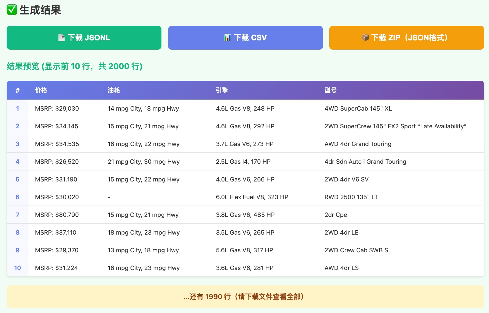

# web2json-agent

**让 AI 自动生成网页解析代码，告别手写 XPath 和 CSS 选择器，轻松得到结构化数据**

## 💡 项目简介

**web2json-agent** 是一个智能数据结构化解析工具，能够**自动分析网页结构并生成高质量的 Python 解析代码，并自动进行数据解析，解析结果如下图所示**。



**节省 80% 的开发时间，从几小时到几分钟！**

### 📋 视频演示

<div align="center">
  <a href="https://github.com/你的用户名/web2json-agent/releases">
    
  </a>
  <p><em>👆 点击图片观看完整演示视频</em></p>
</div>

---

## 🚀 快速开始

### 通过 pip 安装

```bash
# 1. 安装包
pip install web2json-agent

# 2. 初始化配置
web2json setup

# 模式1：自动模式 (auto) - 快速探索，不确定需要提取哪些字段
web2json -d html_samples/ -o output/result

# 模式2：预定义模式 (predefined) - 明确知道需要提取哪些字段，需要精确控制输出结构
web2json -d html_samples/ -o output/result --interactive-schema
```

---

## 📄 许可证

MIT License

---
