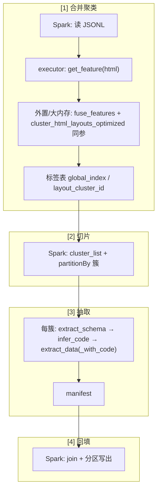

# ms-web-mma：聚类 → 按簇抽取 → 回填原始 JSONL（流程说明稿）

> 本文档描述针对 `web2json-agent/Prod/ms-web-mma/` 下**全部 crawl JSONL** 的**目标流程**与**数据契约**，便于评审；**暂不涉及具体代码改动**。

---

## 1. 背景与目标

**一句话目标**：对 `ms-web-mma` 全目录 crawl 数据**只做一次**布局聚类；再**按簇**分别跑 schema / parser / 抽取；最后用 **`cluster_list.jsonl` + manifest** 把结果**对齐回填**到原始行，生成带 **`remark`、`track_loc`、`doc_loc`** 的发布向 JSONL（不在行内增加 `_w2j` 类字段）。

- **输入**：`Prod/ms-web-mma/` 目录（可递归）下所有 `*.jsonl`，每行一条 JSON，至少包含 **`html`** 字段（及 `track_id` 等溯源字段）。
- **目标**：
  1. 对所有行的 `html` **统一做一次**布局聚类（不按单个 jsonl 文件串行跑完整流水线）。
  2. 将数据**按簇切片**成多份 JSONL，**每个簇**分别执行 `extract_schema` → `infer_code` → `extract_data`（或 `extract_data_with_code`）。
  3. 将每簇抽取得到的**结构化结果**（如 `content`、`title` 等）以及 **schema / xpath 元信息**（如 `remark.extract_schema`）**回填**到**原始行**对应位置，产出**新的 JSONL**（行数与溯源与原始对齐或可追踪）。

---

## 2. 产物目录建议：`cluster_list/` 文件夹

单文件聚类会写出 `cluster_list.jsonl`；全目录合并聚类建议统一到 **`output/ms-web-mma/v001/`**（版本号可换）下，结构示例：

```text
output/ms-web-mma/v001/
├── jsonl/                                    # 可选：发布或中间 gzip 与原始命名对齐
│   └── 20260310....jsonl.gz
│   └── ...
└── cluster_list/
    ├── cluster_info.txt                      # 人类可读摘要（可选）
    ├── cluster_list.jsonl                    # 全局索引：global_index ↔ 源文件/行号/簇 id
    └── format_clusters/                    # 按簇切分后的输入（名称可改为 slices/）
        ├── cluster_0/
        │   └── <stem>_cluster_0.jsonl.gz     # 仅含 cluster_0 的原始行（可选附加调试字段）
        ├── cluster_1/
        │   └── ...
        └── noise/
            └── <stem>_noise.jsonl.gz
```

说明：

- **`cluster_list/cluster_list.jsonl`**：回填时的**主索引**（见 §4.2）。
- **`format_clusters/cluster_k/`**（或扁平命名）：每个簇一份切片，供该簇 `extract_schema` 起全流程使用；**簇编号建议与 `layout_cluster_id` 一致**（`cluster_0` 而非 `cluster_01`，除非团队另有约定）。
- 文件名中的 **`<stem>`** 可与源 `jsonl` 主名一致，便于对照（多源合并时也可用 `union` 等统一前缀）。

---

## 3. 流程总览（四段）

```text
[1] 合并聚类（全目录 jsonl）
        ↓
[2] 写出 cluster_list/ + 按簇切片 jsonl
        ↓
[3] 对每个 cluster_k 独立跑：extract_schema → infer_code → extract_data(_with_code)
        ↓
[4] 合并回填：按 cluster_list + manifest 对齐，写「新 jsonl」
    - 保留原 crawl 字段；新增/覆盖抽取字段；写入 remark、track_loc、doc_loc
```

### 3.1 回填后单行结构示例（目标形态）

以下 **S3 路径为 ms-web-jwn 历史示例**，仅说明字段关系；**ms-web-mma 落地时请替换为实际桶与前缀**。

```json
{
  "track_id": "2201bfce-a0ef-4ca8-90e4-7e34172c9395",
  "url": "https://www.heritage.gov.my/index.php/tapak-warisan",
  "content": "# Tapak Warisan\n\npage_title: Tapak Warisan\ntotal_records: Display #",
  "html": "<!DOCTYPE html>...",
  "content_bytes": 67,
  "remark": {
    "extract_schema": {
      "title": {
        "type": "string",
        "description": "文章标题",
        "value_sample": "Rindukan Muzium. Berita baik untuk anda!",
        "xpaths": ["//h1[@class='page-title kl-blog-post-title entry-title']/text()"]
      },
      "author": {
        "type": "string",
        "description": "作者姓名",
        "value_sample": "defaultweb",
        "xpaths": ["//span[@class='itemAuthor ...']/text()"]
      },
      "publish_time": {
        "type": "string",
        "description": "发布时间",
        "value_sample": "Rabu, 29 September 2021",
        "xpaths": ["//span[@class='itemDateCreated ...']/text()"]
      },
      "content": {
        "type": "string",
        "description": "文章正文内容（完整文本）",
        "value_sample": "Muzium Sejarah ...",
        "xpaths": ["//div[@class='itemBody ...']/p//text()"]
      },
      "content_paragraphs": {
        "type": "array",
        "description": "文章段落列表",
        "value_sample": ["..."],
        "xpaths": ["//div[@class='itemBody ...']/p"]
      },
      "content_list_items": {
        "type": "array",
        "description": "文章中的列表项",
        "value_sample": ["...", "..."],
        "xpaths": ["//div[@class='itemBody ...']//ul/li"]
      }
    }
  },
  "track_loc": [
    "s3://.../prod/ms-web-mma/jsonl/<源>.jsonl?bytes=<offset>,<length>" //  input path defined in web2json-agent/Prod/ms-web-mma/s3Path.txt
  ],
  "doc_loc": "s3://.../nlp/ms-web-mma/v001/ms/<发布文件>.jsonl.gz?bytes=0,0" //  output path defined in web2json-agent/Prod/ms-web-mma/s3Path.txt
}
```

---

## 4. 各阶段说明

### 4.1 阶段一：统一 classify（合并聚类）

- **输入**：`Prod/ms-web-mma/**/*.jsonl`（或顶层仅 jsonl 的目录）。
- **行为**：与现有 `classify_crawl_jsonl_dir` 一致：所有行的 `html` 进入**同一套**布局聚类，得到 `layout_cluster_id ∈ {0,1,…} ∪ {-1}`（噪声）。
- **不要求**在此阶段跑 `extract_schema`。

### 4.2 阶段二：切片与 `cluster_list`

- **`cluster_list.jsonl`**（每行一条建议字段）：

| 字段 | 含义 |
|------|------|
| `global_index` | 全合并后的从 0 开始的序号（或从 1，实现需统一） |
| `layout_cluster_id` | 聚类标签，`-1` 表示噪声 / 无法聚类 |
| `source_jsonl` | 原始文件绝对路径或可解析的相对路径 |
| `source_name` | 文件名 |
| `line_no` | 在该 jsonl 文件内的行号（从 1 计） |
| `record_id` | 业务主键，如 `track_id`；缺失时可用 `line_{line_no}` |

- **切片文件**：每个 `cluster_k` 一个 jsonl，每行仍是**原始 crawl 行**（JSON 对象），如需调试可在切片阶段可选附加与 `cluster_list` 一致的元信息副本（例如簇 id、源文件名、行号），**不要求**使用 `_w2j` 前缀字段。

**噪声** `noise` 可单独一个 `*_noise.jsonl`；是否对该文件也跑抽取由产品决定（默认可跳过或只跑兜底 parser）。

### 4.3 阶段三：按簇抽取（现有 web2json API）

对每个 `cluster_k` 的切片：

1. **`extract_schema`**：得到 `final_schema.json`（字段定义、xpath、`value_sample` 等）。
2. **`infer_code`**：生成 `final_parser.py`。
3. **`extract_data` / `extract_data_with_code`**：对该簇**全部行**解析，得到多份 `result/*.json` 或与行一一对应的结构化结果。

**注意**：簇内解析结果的「键」必须与回填时能**对应回** `cluster_list` 中的某一行（见 §5.2）。

### 4.4 阶段四：回填组成新 JSONL

**目标**：在**不丢失原始 crawl 字段**的前提下，把本簇抽取结果写回「原始行」的扩展形态。

---

## 5. 回填数据契约（建议）

### 5.1 新 JSONL 每行建议结构（逻辑）

在原始对象基础上**增量合并**（字段名可评审后固定）：

- **抽取正文等**：如 `content`、`title`、`author`、`publish_time` 等——与 `final_schema` / parser 输出一致。
- **schema / xpath 溯源**：放入 **`remark.extract_schema`**（结构见 §3.1），与顶层抽取字段区分，避免与 crawl 原字段无意义冲突。

说明：

- **`remark.extract_schema`**：存放**该簇最终 merged schema**（每字段含 `type` / `description` / `value_sample` / `xpaths`）；若体量大，可改为只存 **schema 的 S3/本地路径** + **hash**，正文仍保留顶层抽取值。
- **非空策略**：仅当某字段在 parser 结果中非空（或满足 QA 规则）时写入顶层；否则可省略或显式 `null`（需统一约定）。
- **`track_loc` / `doc_loc`**：与现有发布规范对齐（见《多语种网站清洗计划》§4.4）；`doc_loc` 指向 gzip 发布产物时需带 `?bytes=`。流水线产物路径如需落盘，可放在 `remark` 或单独 manifest，**不**在行顶层增加 `_w2j`。

### 5.2 对齐键（回填时如何「找到原始行」）

必须能唯一对应：

- **主键**：`(source_jsonl, line_no)` 或 `record_id`（全局唯一时）。
- **簇内解析顺序**：若 parser 按切片文件顺序输出，需与 `global_index` 或 `(source_name, line_no)` 建立**显式映射**（建议在抽取阶段输出 **`manifest.jsonl`**：一行对应 `global_index` → 解析结果或 `result_xxx.json`）。

推荐在阶段三结束时为每个 cluster 产出一个 **`cluster_k_extract_manifest.jsonl`**：

```json
{"global_index": 123, "source_name": "part-000.jsonl", "line_no": 45, "record_id": "uuid", "parse_ok": true}
```

回填脚本依赖：**`cluster_list.jsonl` + manifest + 每行 parse 结果**（三者 join）。

### 5.3 工程与分布式（评审点）

- **Spark / 分区**：聚类前可分区读 jsonl；**回填**建议按 **原始 `source_name` 或分区键** 写回，避免单 task 超大 shuffle。
- **幂等**：同一 `global_index` 重复跑应可覆盖或带 `schema_version`。
- **与 Spark 的分工**：四段流程在集群上的拆分见 **§5.4**；其中布局侧须与 **web2json** 现网逻辑一致（`get_feature` → `fuse_features` → `cluster_html_layouts_optimized` 等）。

### 5.4 Spark 阶段划分草图（对齐 web2json 逻辑）

以下与 §3「四段流程」一一对应；**布局聚类与单机 `classify_crawl_jsonl` / `classify_crawl_jsonl_dir`（`web2json.simple`）同源**，Spark 只负责可并行 I/O 与 join，**不另写一套特征或聚类定义**。

**web2json 侧关键符号（须保持一致）**

| 名称 | 位置 | 作用 |
|------|------|------|
| `get_feature` | `web2json.tools.html_layout_cosin.get_feature` | 输入 HTML 字符串，输出**布局特征 dict**（`tags` / `attrs` 等层级结构）。 |
| `fuse_features` | `web2json.tools.html_layout_cosin.fuse_features`（由 `cluster` 内部调用） | 在统一 `layer_n`、`k` 下将多页 dict **融合为稠密向量**，供余弦相似度与 DBSCAN。 |
| `cluster_html_layouts_optimized` | `web2json.tools.cluster.cluster_html_layouts_optimized` | 与 `simple._execute_crawl_layout_cluster` 相同入口：`threshold`、`k`、`min_samples`、`use_knn_graph`、`n_neighbors` 等须与线上一致，否则簇 id 不可比。 |
| `classify_crawl_jsonl` / `classify_crawl_jsonl_dir` | `web2json.simple` | 单机全链路：读 JSONL → 上述特征与聚类 → 写 `cluster_list` / 按簇切片。 |
| `extract_schema` / `infer_code` / `extract_data` / `extract_data_with_code` | `web2json.simple` | §4.3 按簇流水线；回填依赖 manifest 与 `cluster_list` join（§5.2）。 |

**阶段映射（文档 §3 ↔ Spark / 混部）**

| 文档阶段 | Spark 上适合做的事 | 须沿用 web2json 或外置作业的部分 |
|----------|-------------------|----------------------------------|
| **[1] 合并聚类** | 并行读 JSONL、解析行；在 executor 上对每行 HTML 调用 **`get_feature`**（与 `web2json.tools.cluster._compute_features` 相同）。 | **全局聚类**：在单机路径中为 **`cluster_html_layouts_optimized`**（内部：`fuse_features` → `cosine_similarity` + DBSCAN，或 `use_knn_graph` 近似）。分布式上需**二次开发或外置**：例如先落盘全量 feature dict，再在**大内存单机 / Ray** 调同一套 `fuse_features`+聚类，产出 `global_index → layout_cluster_id` 表再回灌 Spark；**禁止**换用与 `get_feature` 无关的自研特征。 |
| **[2] cluster_list + 切片** | 对标签表生成 `cluster_list.jsonl`；按 `layout_cluster_id` **partitionBy** 写各簇 JSONL（及 `noise`）。可选行内附加 `layout_cluster_id`、`crawl_source_name`、`crawl_line_no`（与 `annotate_slice_rows` 约定一致）。 | 字段语义同 §4.2。 |
| **[3] 按簇抽取** | 若仅用生成好的 `final_parser.py` 做 CPU 解析，可用 **`mapPartitions`** 批量跑解析（等价于 `extract_data_with_code` 的解析段）。 | **`extract_schema` / `infer_code`**（及含 LLM 的 schema 生成）多为 **每簇独立作业**（编排起 Pod/单机），与现网 API 一致；产出每簇 **`cluster_k_extract_manifest.jsonl`**（§5.2）。 |
| **[4] 回填** | **`join`**：`cluster_list` + manifest + 解析结果；合并 `remark`、`track_loc`、`doc_loc`；**按 `source_name` 或分区键写出**，控制 shuffle。 | 逻辑同 §5.1，不新增 `_w2j` 顶层字段。 |

**流程简图（执行形态）**



**小结**：Spark 擅长 **[2][4]** 与 **[1] 中的读数 + **`get_feature`**；**与 `cluster_html_layouts_optimized` 等价的聚类**和 **含 LLM 的 [3] 前段**宜混部或编排，且 **特征与聚类参数必须来自 web2json**，以保证与 `Prod` 本地/单机试跑结果可对齐。

---

## 6. 待确认清单

1. **`format_clusters` 命名**是否改为 `slices/` 或 `by_cluster/`？
2. **回填产物**：按**源文件一对一**（`xxx.with_extract.jsonl`）还是**单文件 merged**？
3. **噪声簇**是否跑抽取，还是仅打标原样输出？
4. **ms-web-mma** 正式 **S3 前缀**与 **doc_loc** 桶是否已定稿（文档中示例路径需替换）？

---

## 7. `Prod/ms-web-mma` 本地目录快照（便于对齐 S3 与聚类输入）

约定见同目录 **`s3Path.txt`**（Input：`hcorpus-develop-hw60p/.../prod/ms-web-mma/jsonl/`；Output：`xyz2-process-hdd1/.../nlp/ms-web-mma/v0001`）。

当前仓库内该目录含 **6 个** `*.jsonl` + `s3Path.txt`：

| 文件 | 行数（约） | 说明 |
|------|------------|------|
| `20260310094859_353_79bda33fa180eedac40d37876224609d.jsonl` | 191 | 主数据量（约 61MB，单行 HTML 较大） |
| `20260312172301_353_ac06ada8c9d8f53d11ff4ce459ff470e.jsonl` | 1 | 小样本 |
| `20260320141631_353_2f2ece9c1819287308a80962f0f108f5.jsonl` 等 4 个 | 各 1 | 同日多批次试探样（各约百 KB 级） |

**清洗建议**：聚类/回填以 **191 行主文件**为基准即可；其余 5 个单行文件若仅为调试，可迁到子目录（如 `samples/`）或归档，避免与全量 `discover_jsonl_files` 合并时重复混入（若暂不移除，合并跑目录时需知悉总行数 ≈ **196** 且含重复 URL 风险）。是否搬迁由工程侧决定。
